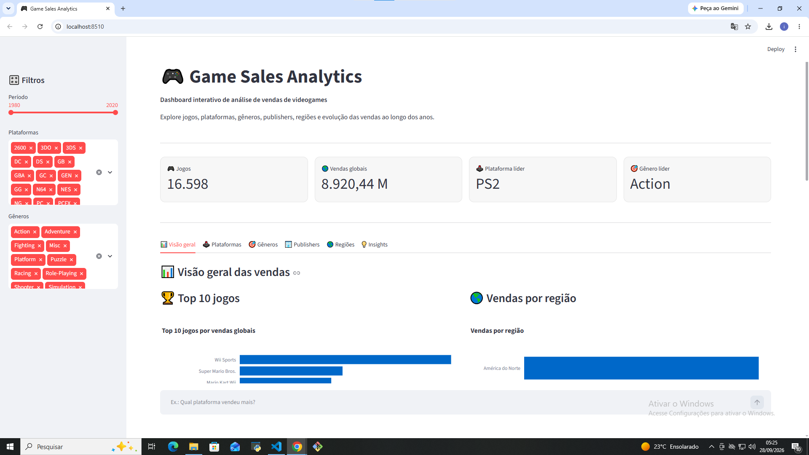
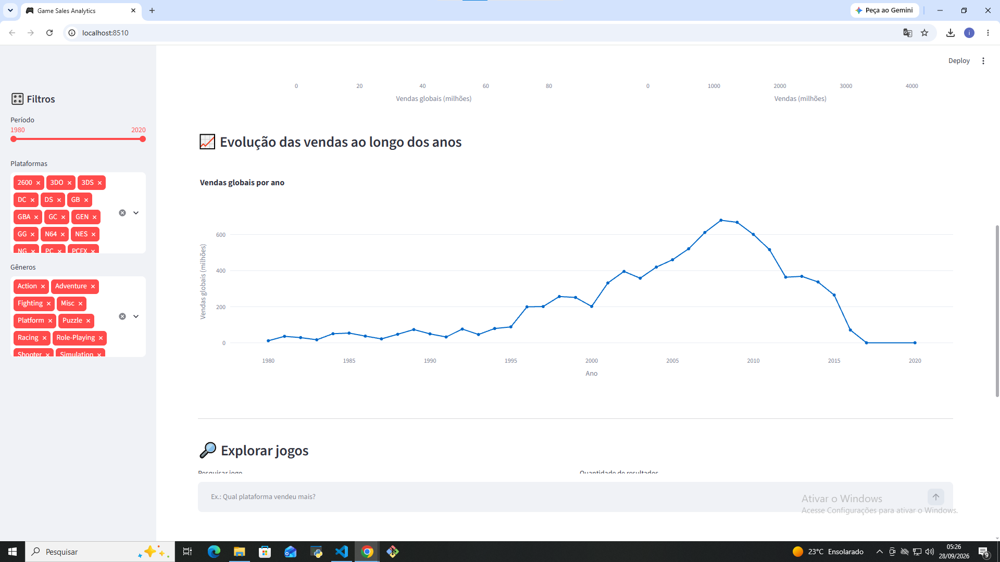
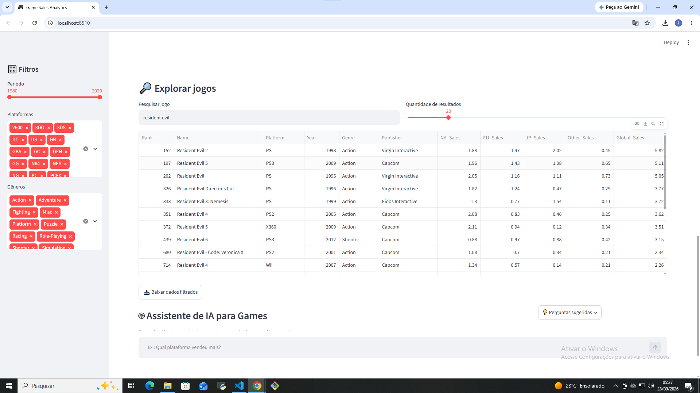
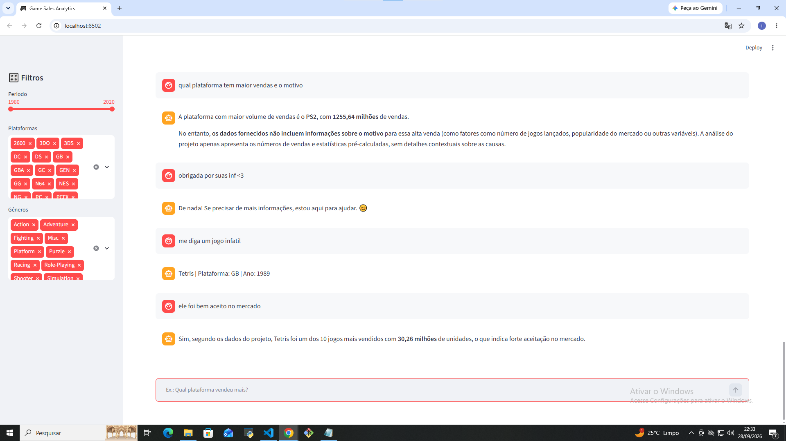

# 🎮 Game Sales Analytics: Entendendo o Mercado de Games de um Jeito Simples

## 💡 Por que eu criei esse projeto?

O mercado de videogames é gigantesco, movimenta bilhões e muda o tempo todo. Mas, se a gente for olhar os dados brutos de vendas, é tanta informação espalhada que fica difícil tirar alguma conclusão útil. 

A ideia de criar esse projeto surgiu justamente para resolver isso: juntar um mar de dados históricos da indústria de games e transformar em algo **visual, prático e fácil de entender** para qualquer pessoa que goste ou trabalhe com essa área.

# 📊 Uma visão bem clara de como o mercado funciona
Com esse painel interativo, dá para entender o panorama completo :

📈 A evolução do tempo: Dá para ver claramente como a indústria cresceu, quais foram os anos de ouro das vendas e como o mercado se comportou ao longo das décadas.

🎯 O que o público curte: Você descobre na hora quais consoles mandaram bem no mercado e quais gêneros de jogos vendem mais.

🌍 regiões: O painel mostra exatamente onde os jogos vendem mais (América do Norte, Europa, Japão, etc.), o que ajuda a entender gostos diferentes pelo mundo.

# ⚡ Praticidade : Filtros e Inteligência Artificial
A parte mais legal é que você não precisa ficar perdendo horas procurando as coisas numa tabela gigante:

🎛️ Filtros rápidos (Streamlit): Na barra lateral, você consegue filtrar tudo por período, plataforma ou gênero com poucos cliques, e os gráficos se atualizam.

## 🤖 Assistente de IA integrado: Se você quiser saber algo específico — tipo perguntar se um jogo vendeu bem ou qual plataforma liderou —, basta mandar mensagem no chat. A IA entende o que você digitou e puxa os números reais calculados pelo sistema para te responder .

abaixo os anexos dos das imagens com o funcionamento dos arquivos:

### Visão Geral e KPIs

### Evolução Temporal das Vendas

### Exploração de Jogos e Busca

### Chat com IA Integrada

